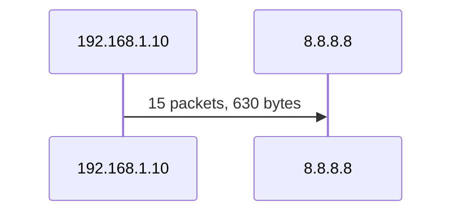

# NetCap Analysis Tool

Network packet capture and analysis tool with visualization and reporting.

## Features

- **Packet Capture**: Capture live network traffic using scapy or tshark
- **Packet Length Analysis**: Bar chart showing distribution of packet sizes
- **Port Analysis**: Bar chart of top destination ports with service names
- **Conversation Tracking**: UML sequence diagrams showing IP conversations
- **Reports**: Markdown reports with embedded mermaid diagrams
- **Chart Export**: PNG and mermaid format exports

## Installation

```bash
# Clone or navigate to the project directory
cd /home/bill/src/ai/system/netcapanalysis

# Create virtual environment
uv venv .venv

# Activate virtual environment
source .venv/bin/activate

# Install dependencies
pip install --break-system-packages -e .
```

## Requirements

- Python 3.8+
- scapy (for packet capture and analysis)
- matplotlib (for PNG charts)
- click (CLI framework)
- tshark/wireshark (optional, for enhanced capture)

## Usage

### Capture Packets

Capture live network traffic to a pcap file:

```bash
# Capture 100 packets on default interface
netcapanalysis capture -c 100 -o capture.pcap

# Capture on specific interface
sudo netcapanalysis capture -i eth0 -c 100 -o capture.pcap

# Capture with BPF filter (e.g., only TCP traffic)
sudo netcapanalysis capture -i eth0 -f "tcp" -c 100 -o capture.pcap

# Capture for specific duration (seconds)
sudo netcapanalysis capture -i eth0 -d 30 -o capture.pcap
```

### Analyze PCAP File

Generate a comprehensive markdown report:

```bash
netcapanalysis analyze -i capture.pcap -o report.md
```

This generates:
- Summary statistics (total packets, bytes, average length)
- Protocol distribution table
- Packet length distribution chart (PNG + mermaid)
- Top destination ports chart (PNG + mermaid)
- Conversation sequence diagram (PNG + mermaid)
- Detailed conversation table

### Generate Charts

Create individual charts from a pcap file:

```bash
# Packet length distribution
netcapanalysis chart -i capture.pcap -o length.png -t length

# Top destination ports
netcapanalysis chart -i capture.pcap -o port.png -t port

# Conversation diagram
netcapanalysis chart -i capture.pcap -o conversation.png -t conversation
```

### Generate Mermaid Diagrams

Export mermaid format for use in other tools:

```bash
netcapanalysis mermaid -i capture.pcap -o diagram.mmd
```

## Root Privileges (sudo)

Live packet capture requires root privileges because:
- Network interfaces need admin access to capture packets
- Raw socket access is restricted to root users

### Option 1: Run with sudo

```bash
sudo $(which netcapanalysis) capture -i eth0 -c 100 -o capture.pcap
```

### Option 2: Set up sudo alias

Add to your `~/.bashrc` or `~/.zshrc`:

```bash
alias netcap='sudo $(which netcapanalysis)'
```

Then use:
```bash
netcap capture -i eth0 -c 100 -o capture.pcap
```

### Option 3: Give limited sudo access (recommended)

Create `/etc/sudoers.d/netcapanalysis` (use `sudo visudo`):

```
# Allow specific user to run netcapanalysis capture with tshark
username ALL=(root) NOPASSWD: /usr/bin/tshark
```

### Option 4: Run scapy as root

If using scapy directly, you need root:

```bash
sudo -E PATH="$PATH" .venv/bin/python -c "from scapy.all import *; print('scapy ready')"
```

## Examples

### Basic Workflow

```bash
# 1. Capture some traffic
sudo netcapanalysis capture -i eth0 -c 500 -o traffic.pcap

# 2. Analyze and generate report
netcapanalysis analyze -i traffic.pcap -o report.md

# 3. View the report
cat report.md
```

### Analyze Existing PCAP

```bash
# If you have a pcap file from Wireshark
netcapanalysis analyze -i /path/to/capture.pcap -o report.md
```

### Compare Traffic

```bash
# Generate charts for two different captures
netcapanalysis chart -i before.pcap -o before_port.png -t port
netcapanalysis chart -i after.pcap -o after_port.png -t port
```

## Output Formats

### Markdown Report

The generated report includes:
- Summary statistics table
- Protocol distribution
- Length distribution (chart + mermaid pie)
- Port statistics (chart + mermaid pie)
- Conversation details (mermaid sequence diagram)

### Mermaid Diagrams

Generated in sequenceDiagram format:



### PNG Charts

- Bar charts for packet length distribution
- Bar charts for port statistics

## Troubleshooting

### "Operation not permitted" error

You need root privileges to capture packets:
```bash
sudo netcapanalysis capture -i eth0 -c 10 -o test.pcap
```

### "Interface not found" error

List available interfaces:
```bash
python -c "from scapy.all import get_if_list; print(get_if_list())"
```

### "Module not found" error

Make sure you're using the virtual environment:
```bash
source .venv/bin/activate
netcapanalysis --help
```

### tshark not found

Install wireshark:
```bash
# Ubuntu/Debian
sudo apt install wireshark tshark

# Or use scapy (included)
```

## Docker

### Build Image

```bash
docker build -t netcapanalysis:latest .
```

### Run Commands

```bash
# Capture packets (requires --privileged)
docker run --rm -it \
  --privileged \
  -v $(pwd)/data:/data \
  netcapanalysis:latest capture -c 100 -o /data/capture.pcap

# Analyze pcap file
docker run --rm -it \
  -v $(pwd)/data:/data \
  netcapanalysis:latest analyze -i /data/capture.pcap -o /data/report.md

# Generate chart
docker run --rm -it \
  -v $(pwd)/data:/data \
  netcapanalysis:latest chart -i /data/capture.pcap -o /data/chart.png -t port
```

### Using Docker Compose

```bash
# Create data directory
mkdir -p data

# Capture packets
docker compose run --rm netcapanalysis capture -c 100 -o /data/capture.pcap

# Analyze
docker compose run --rm netcapanalysis analyze -i /data/capture.pcap -o /data/report.md
```

### Privileges Required

The container needs `--privileged` or specific capabilities for live capture:

```bash
docker run --rm -it \
  --cap-add=NET_RAW \
  --cap-add=NET_ADMIN \
  -v $(pwd)/data:/data \
  netcapanalysis capture -c 100 -o /data/capture.pcap
```

Or use `--privileged` for full access:

```bash
docker run --rm -it --privileged -v $(pwd)/data:/data netcapanalysis capture -c 100 -o /data/capture.pcap
```

## License

MIT
