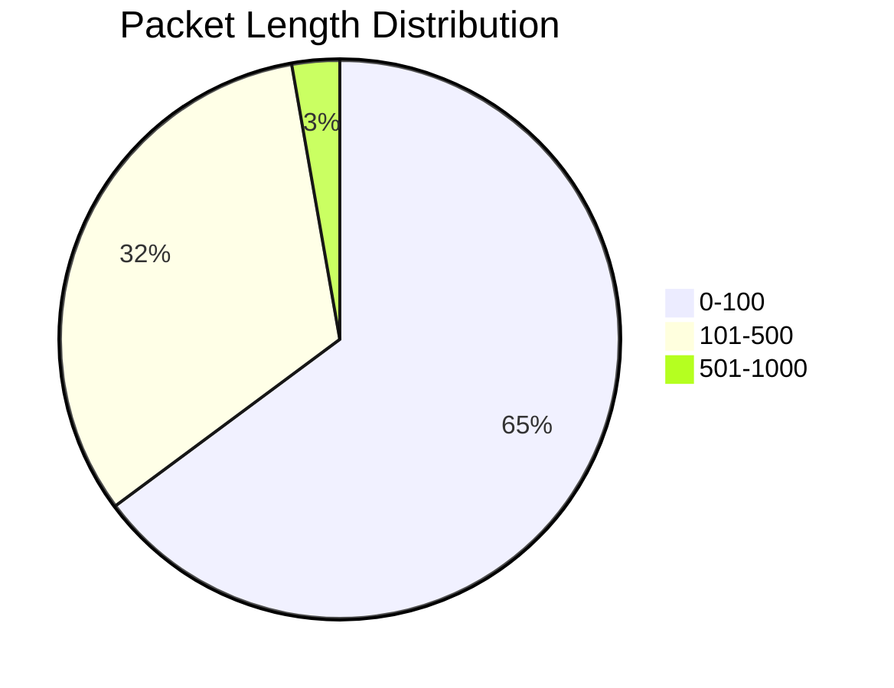
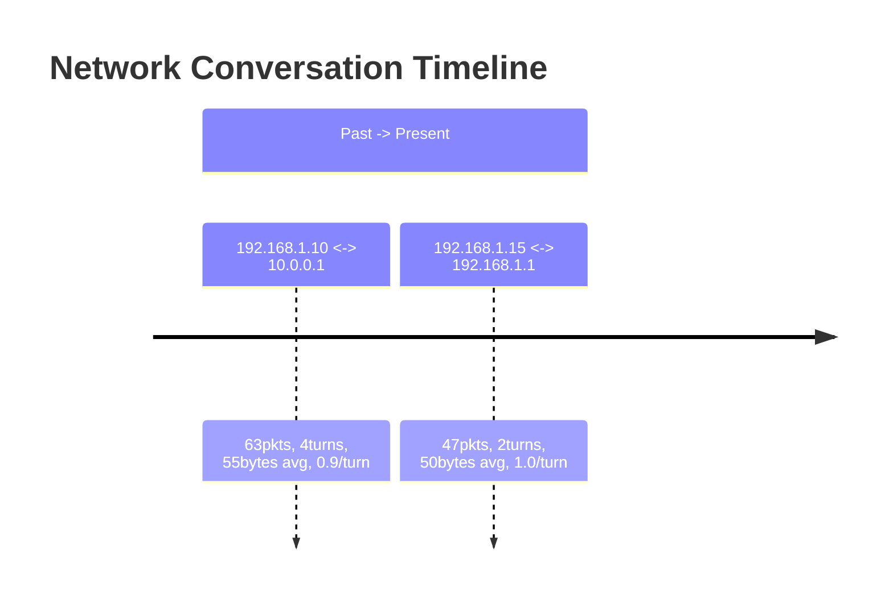

# Report Formats

## Single File Analysis Report

Generated by `analyze` command.

### Sections

1. **Summary Statistics**
   - Total Packets
   - Total Bytes
   - Average Packet Length

2. **Protocol Distribution**
   - Table of protocols and packet counts
   - Protocols: TCP, UDP, ICMP, etc.

3. **Packet Length Distribution**
   - Bar chart (PNG)
   - Mermaid pie chart
   - Buckets: 0-100, 101-500, 501-1000, 1001-1500, 1500+

4. **Top Destination Ports**
   - Bar chart (PNG)
   - Mermaid pie chart
   - Table with port number, service name, count
   - Known services: HTTP (80), HTTPS (443), DNS (53), etc.

5. **Conversation Pairs**
   - Conversation diagram (PNG)
   - UML sequence diagram (mermaid)
   - Shows IP pairs with packet/byte counts

6. **Conversation Details**
   - Full table with:
     - Source IP:Port
     - Destination IP:Port
     - Packet count
     - Total bytes
     - Protocols used

### Example Output

```markdown
# Network Capture Analysis Report

**Input File**: capture.pcap

---

## Summary Statistics

| Metric | Value |
|--------|-------|
| Total Packets | 1,234 |
| Total Bytes | 98,765 |
| Average Packet Length | 80.04 bytes |

---

## Protocol Distribution

| Protocol | Packet Count |
|----------|---------------|
| TCP | 1,100 |
| UDP | 134 |

---

## Packet Length Distribution




---

## Top Destination Ports

| Port | Service | Count |
|------|---------|-------|
| 80 | HTTP | 500 |
| 443 | HTTPS | 300 |
| 53 | DNS | 100 |

---

## Conversation Details

| Source | Destination | Packets | Bytes | Protocols |
|--------|-------------|---------|-------|-----------|
| 192.168.1.10:54321 | 8.8.8.8:53 | 50 | 2,500 | UDP |
```

---

## Timeline Analysis Report

Generated by `timeline` command.

### Sections

1. **Summary**
   - Total Conversations (unique IP pairs)
   - Total Packets across all captures
   - Total Bytes
   - Total Turns
   - Avg Packets/Conversation
   - Avg Turns/Conversation

2. **Timeline Chart**
   - Mermaid timeline diagram
   - Shows conversations from past (earliest capture) to present (latest)
   - Each entry shows: IP pair, packet count, turns, avg size, chattiness

3. **Conversation Flow Sequence**
   - Mermaid sequence diagram
   - Shows all participants and message flow

4. **Chattiness Analysis**
   - Bar charts (PNG) showing:
     - Packets per conversation
     - Direction changes (turns)
     - Chattiness ratio

5. **Conversation Details Table**
   - Source IP
   - Destination IP
   - Packet count
   - Total bytes
   - Average packet size
   - Turns (direction changes)
   - Chattiness (packets per interval)

### Metrics Explained

| Metric | Description |
|--------|-------------|
| **Turns** | Number of times the sender changed in a conversation. 1 = unidirectional, more = bidirectional/response pattern |
| **Avg Packet Size** | Total bytes / packet count. Larger packets may indicate bulk transfers |
| **Chattiness** | Packets per packet interval. Higher values indicate more frequent exchanges |

### Example Output

```markdown
# Multi-Capture Timeline Analysis

**Input Files**: capture1.pcap, capture2.pcap

---

## Summary

| Metric | Value |
|--------|-------|
| Total Conversations | 4 |
| Total Packets | 135 |
| Total Bytes | 6,702 |
| Total Turns | 8 |
| Avg Packets/Conversation | 33.8 |
| Avg Turns/Conversation | 2.0 |

---

## Timeline Chart



---

## Conversation Details

| Source IP | Dest IP | Packets | Bytes | Avg Size | Turns | Chattiness |
|-----------|---------|---------|-------|----------|-------|------------|
| 192.168.1.10 | 10.0.0.1 | 63 | 3,481 | 55.3 | 4 | 0.94 |
| 192.168.1.15 | 192.168.1.1 | 47 | 2,344 | 49.9 | 2 | 1.02 |
```

---

## Generated Files

When running analysis, these files are created:

| File | Description |
|------|-------------|
| `report.md` | Main markdown report |
| `report_length.png` | Packet length distribution chart |
| `report_port.png` | Port distribution chart |
| `report_conversation.mmd` | Mermaid sequence diagram |
| `timeline.md` | Timeline analysis report |
| `timeline_chattiness.png` | Chattiness bar charts |
| `timeline_timeline.mmd` | Mermaid timeline |
| `timeline_sequence.mmd` | Mermaid sequence |
