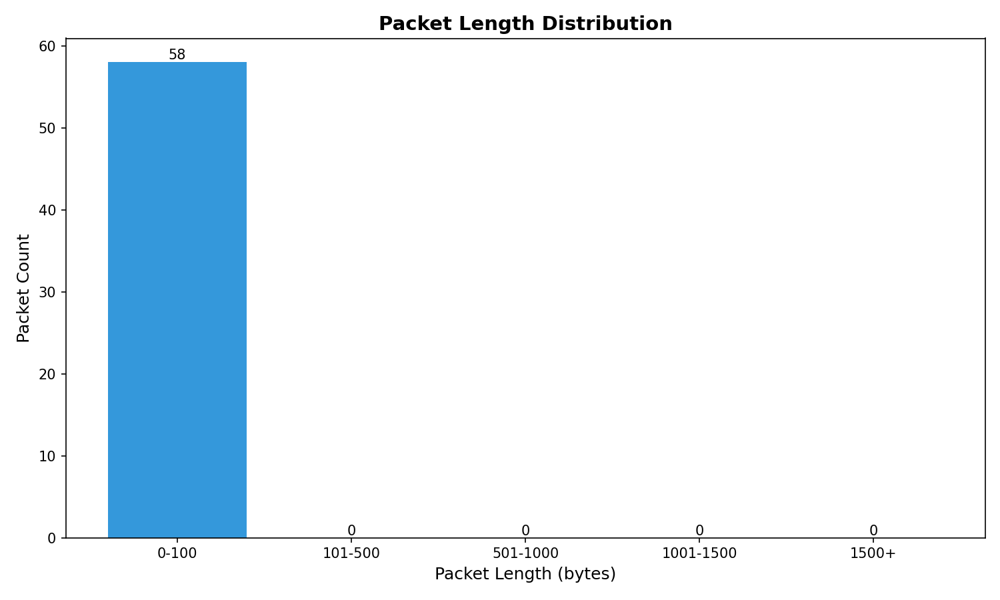
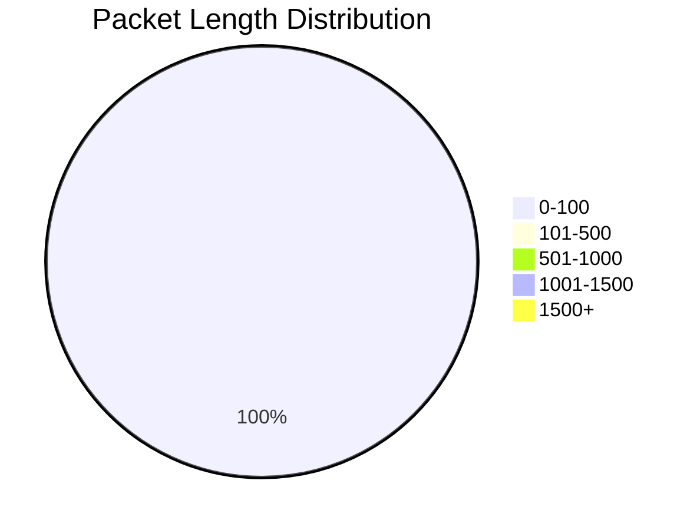
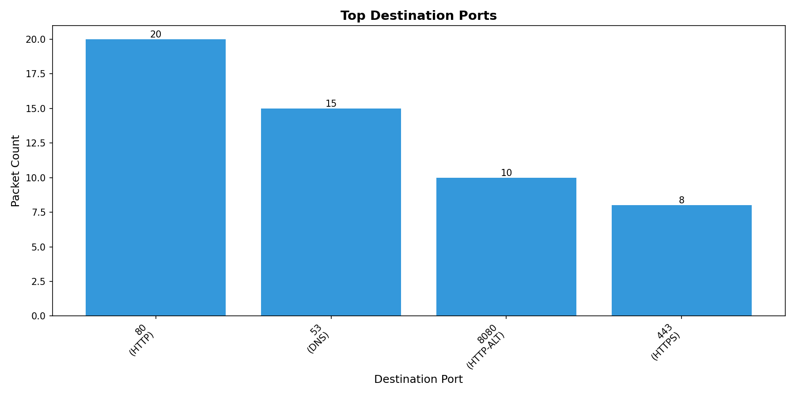
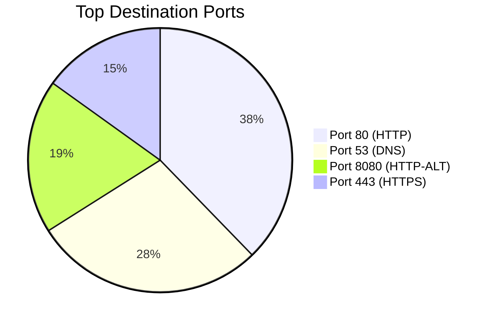
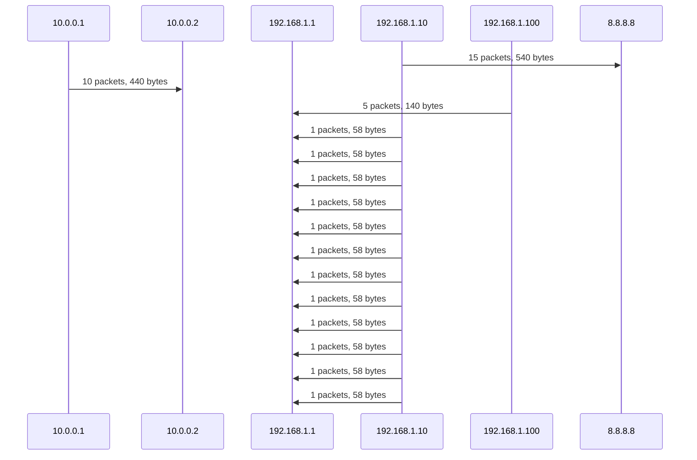

# Network Capture Analysis Report

**Input File**: /data/sample.pcap
**Generated**: report.md

---

## Summary Statistics

| Metric | Value |
|--------|-------|
| Total Packets | 58 |
| Total Bytes | 2,624 |
| Average Packet Length | 45.24 bytes |

---

## Protocol Distribution

| Protocol | Packet Count |
|----------|---------------|
| TCP | 38 |
| UDP | 15 |
| ICMP | 5 |

---

## Packet Length Distribution

---

## Top Destination Ports

| Port | Service | Count |
|------|---------|-------|
| 80 | HTTP | 20 |
| 53 | DNS | 15 |
| 8080 | HTTP-ALT | 10 |
| 443 | HTTPS | 8 |

---

## Conversation Pairs

### UML Sequence Diagram

---

## Conversation Details

| Source | Destination | Packets | Bytes | Protocols |
|--------|-------------|---------|-------|-----------|
| 192.168.1.10:54321 | 8.8.8.8:53 | 15 | 540 | UDP |
| 10.0.0.1:80 | 10.0.0.2:8080 | 10 | 440 | TCP |
| 192.168.1.100:0 | 192.168.1.1:0 | 5 | 140 | ICMP |
| 192.168.1.10:12345 | 192.168.1.1:80 | 1 | 58 | TCP |
| 192.168.1.10:12346 | 192.168.1.1:80 | 1 | 58 | TCP |
| 192.168.1.10:12347 | 192.168.1.1:80 | 1 | 58 | TCP |
| 192.168.1.10:12348 | 192.168.1.1:80 | 1 | 58 | TCP |
| 192.168.1.10:12349 | 192.168.1.1:80 | 1 | 58 | TCP |
| 192.168.1.10:12350 | 192.168.1.1:80 | 1 | 58 | TCP |
| 192.168.1.10:12351 | 192.168.1.1:80 | 1 | 58 | TCP |
| 192.168.1.10:12352 | 192.168.1.1:80 | 1 | 58 | TCP |
| 192.168.1.10:12353 | 192.168.1.1:80 | 1 | 58 | TCP |
| 192.168.1.10:12354 | 192.168.1.1:80 | 1 | 58 | TCP |
| 192.168.1.10:12355 | 192.168.1.1:80 | 1 | 58 | TCP |
| 192.168.1.10:12356 | 192.168.1.1:80 | 1 | 58 | TCP |
| 192.168.1.10:12357 | 192.168.1.1:80 | 1 | 58 | TCP |
| 192.168.1.10:12358 | 192.168.1.1:80 | 1 | 58 | TCP |
| 192.168.1.10:12359 | 192.168.1.1:80 | 1 | 58 | TCP |
| 192.168.1.10:12360 | 192.168.1.1:80 | 1 | 58 | TCP |
| 192.168.1.10:12361 | 192.168.1.1:80 | 1 | 58 | TCP |

---

*Report generated by NetCap Analysis Tool*
